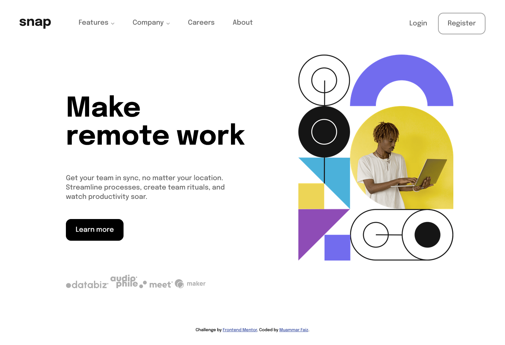

# Frontend Mentor - Intro section with dropdown navigation solution

This is a solution to the [Intro section with dropdown navigation challenge on Frontend Mentor](https://www.frontendmentor.io/challenges/intro-section-with-dropdown-navigation-ryaPetHE5). Frontend Mentor challenges help you improve your coding skills by building realistic projects. 

## Table of contents

- [Overview](#overview)
  - [The challenge](#the-challenge)
  - [Screenshot](#screenshot)
  - [Links](#links)
- [My process](#my-process)
  - [Built with](#built-with)
  - [What I learned](#what-i-learned)
  - [Continued development](#continued-development)
  - [Useful resources](#useful-resources)
- [Author](#author)
- [Acknowledgments](#acknowledgments)

## Overview

### The challenge

Users should be able to:

- View the relevant dropdown menus on desktop and mobile when interacting with the navigation links (done)
- View the optimal layout for the content depending on their device's screen size (done)
- See hover states for all interactive elements on the page (done)

un-mentioned:
- replace the navigation with sidebar in mobile version (done)

### Screenshot



Add a screenshot of your solution. The easiest way to do this is to use Firefox to view your project, right-click the page and select "Take a Screenshot". You can choose either a full-height screenshot or a cropped one based on how long the page is. If it's very long, it might be best to crop it.

Alternatively, you can use a tool like [FireShot](https://getfireshot.com/) to take the screenshot. FireShot has a free option, so you don't need to purchase it. 

Then crop/optimize/edit your image however you like, add it to your project, and update the file path in the image above.

### Links

- Solution URL: [Github repository](https://github.com/muammarFaiz/frontendmentor_introSectionDropdownSidebar)
- Live Site URL: [Github page](https://muammarfaiz.github.io/frontendmentor_introSectionDropdownSidebar/)

## My process

### Built with

- HTML
- CSS
- Flexbox
- CSS Grid
- Desktop-first workflow
- [React](https://reactjs.org/) - JS library

### What I learned

- dropdown menu using checkbox input as the button
```html
<input type="checkbox" id="dropdown" hidden>
<label for="dropdown" class="label">click here</label>
<ul class="dropdownItems">
  <li>dropdown items</li>
  <li>dropdown items</li>
</ul>
```
```css
.dropdownItems {
  display: none;
}
#dropdown:checked~.dropdownItems {
  display: block;
}
```
- change img on clicked with CSS
```css
.thecheckbox:checked~.theimg {
  content: url("./newimg.jpg")
}
```
- inspector and style editor tabs from firefox devtool is linked, so i can copy and paste the css from firefox to my vscode, after live editing in firefox devtool

### Continued development

trying to write a better CSS

### Useful resources

- [MDN Web Docs](https://developer.mozilla.org/en-US/) - for obvious reasons.
- [W3Schools](https://www.w3schools.com/) - non intimidating place to learn.
- [Kevin Powell Youtube Channel](https://www.youtube.com/channel/UCJZv4d5rbIKd4QHMPkcABCw) - easy to understand CSS tutorials, the king of css.

## Author

- LinkedIn - [Muammar Faiz](https://www.linkedin.com/in/muammar-faiz-99758a227/)
- Frontend Mentor - [@muammarFaiz](https://www.frontendmentor.io/profile/muammarFaiz)

## Acknowledgments

no one but myself who directly contributed to this project, but there is a few person that helped me to be a better programmer, mr Kevin Powell from his youtube channel is one of them also mr Reza my mentor from eduwork, and others.
